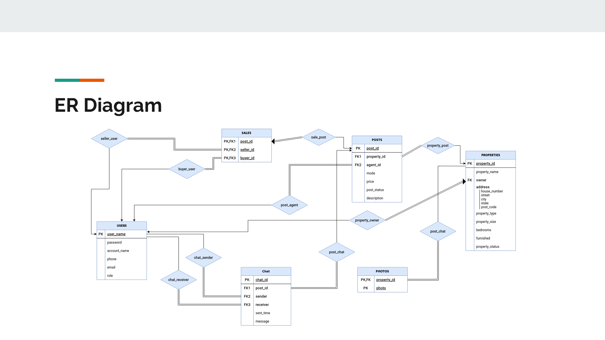
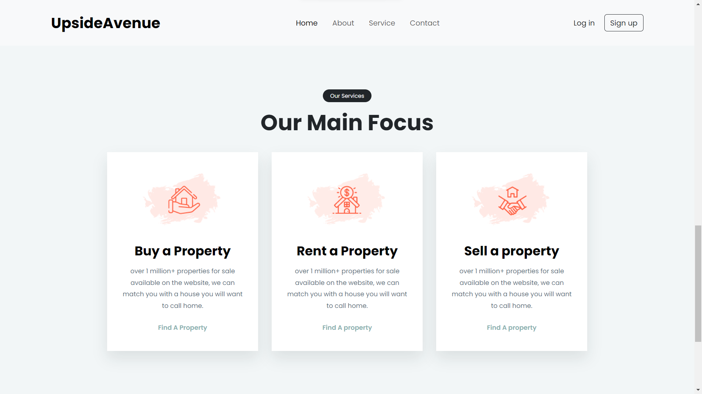
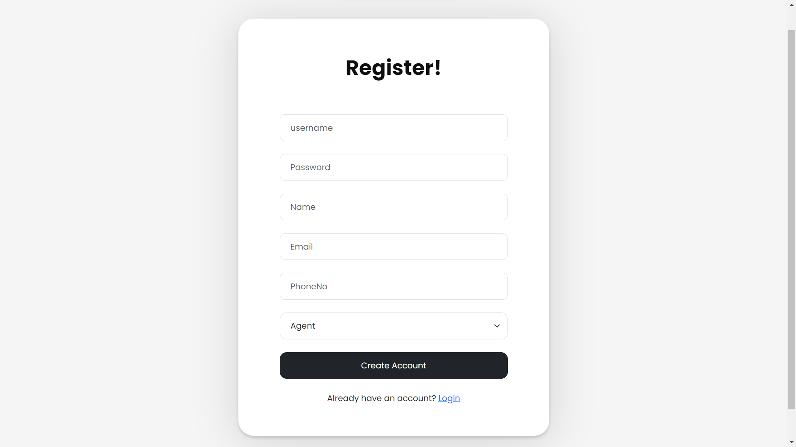
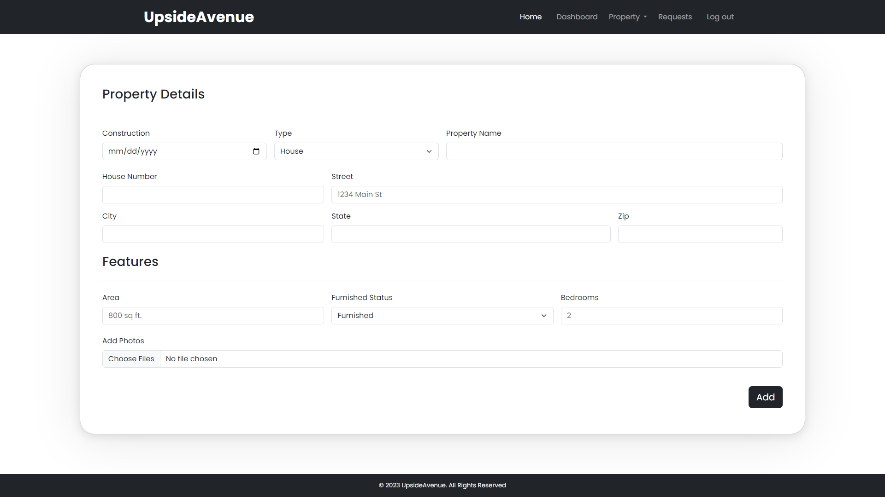

# Upside Avenue

Upside Avenue is a university project on Real Estate Management System.

# Description

Upside Avenue does an incredible job of connecting buyers and sellers through agents. We provide a full stack service for all real estate needs. A platform for sellers to post about their properties which buyers can find and contact sellers with an agent in mediation.

## ER Diagram

<<<<<<< HEAD
=======
## ER Diagram
>>>>>>> e3f2f02078a8009b291699225cddad58f0818365

## Preview

<<<<<<< HEAD
### Main

### Services

### Signup

### Properties

### addProperty

### MyPost

=======